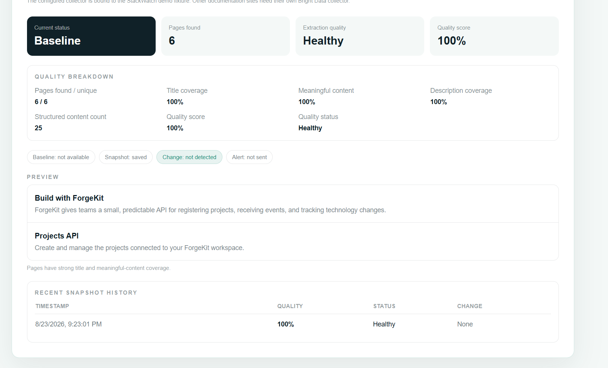
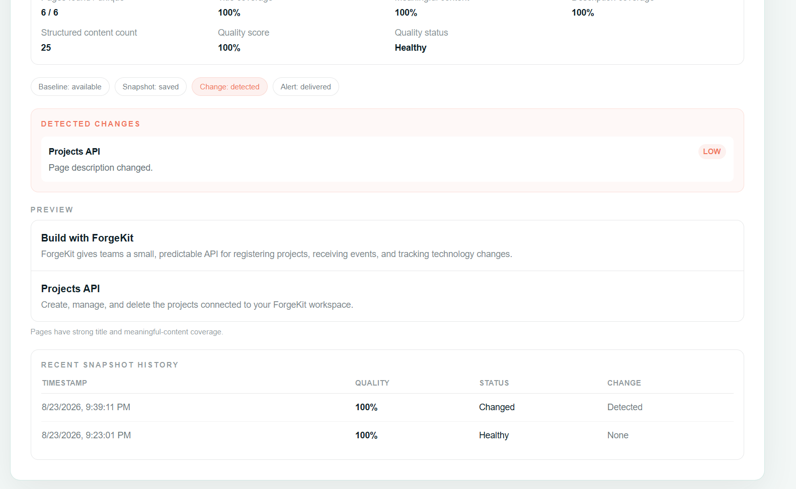
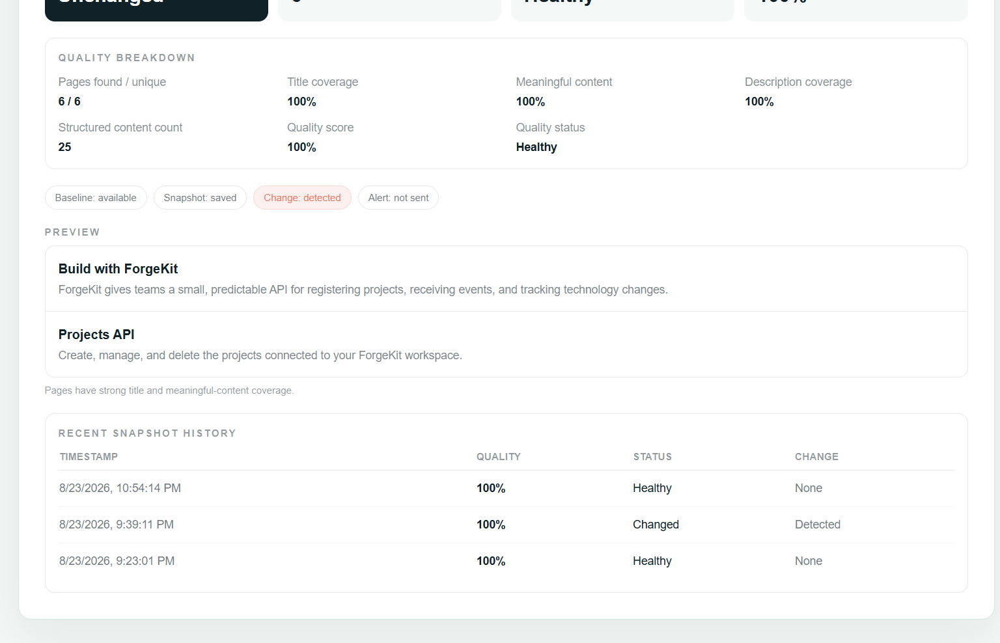
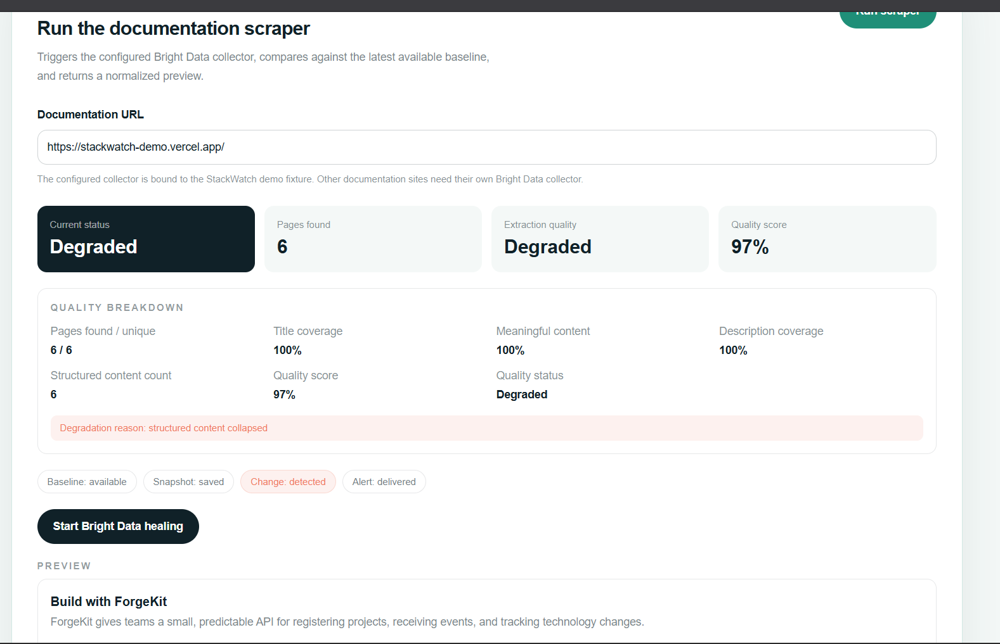
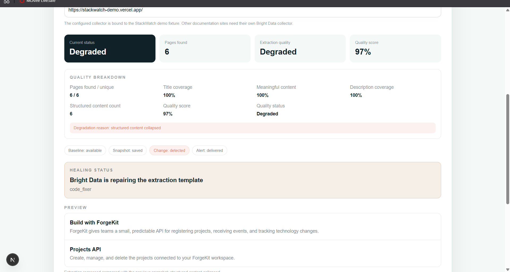
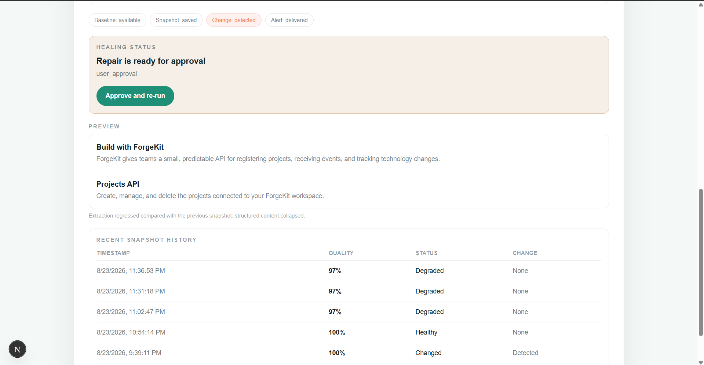
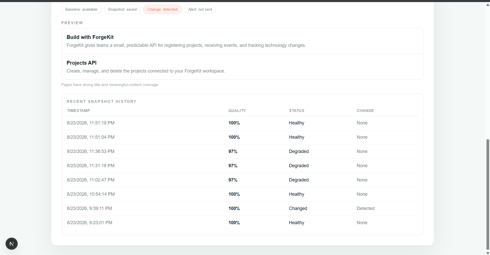
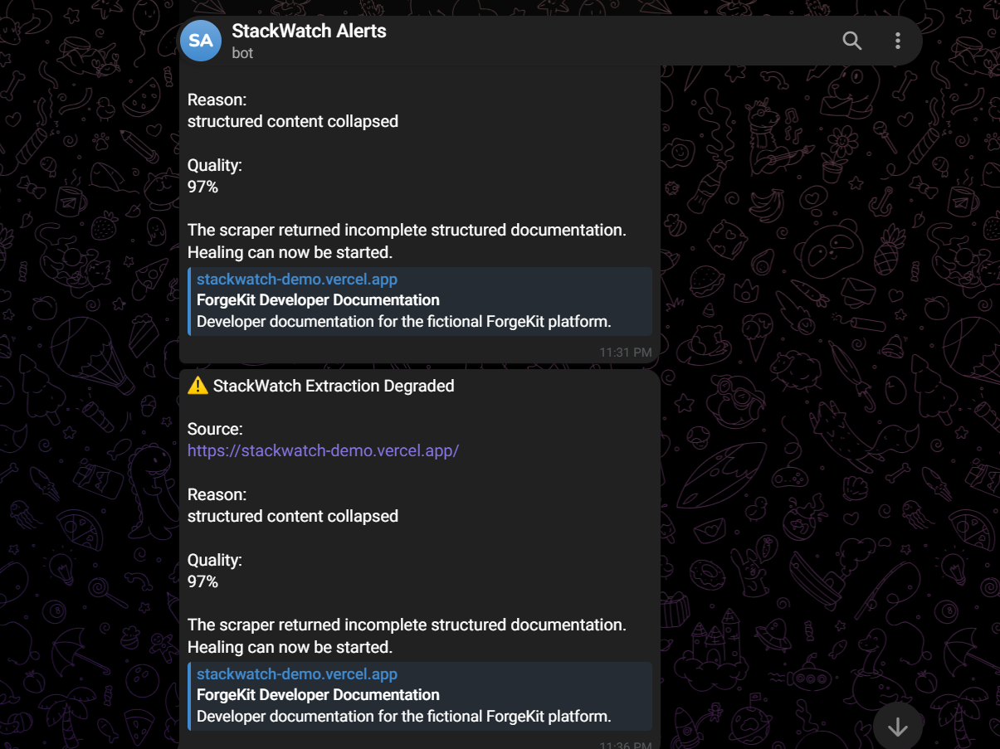
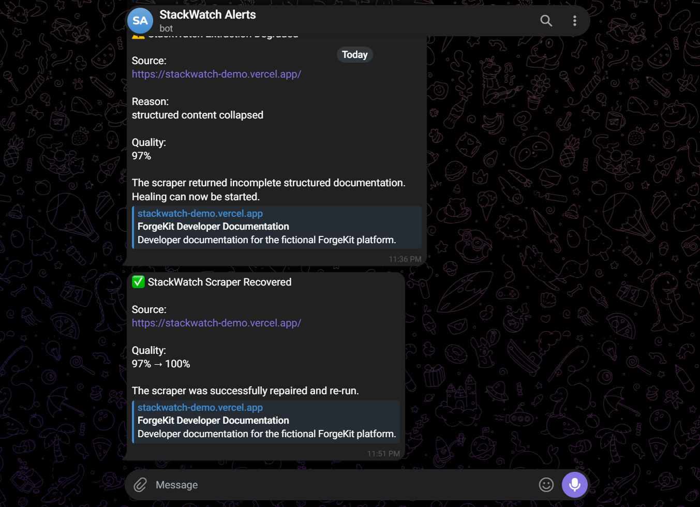

# StackWatch — ScrapeVerse Demo

> **StackWatch watches documentation for changes, verifies that extraction is still healthy, and can use Bright Data's refactoring/healing flow to recover when the extraction template breaks.**

## 1. About the project

Documentation changes are easy to miss.

A scraper can continue running successfully while silently extracting less and less useful content after a documentation site changes. StackWatch treats **extraction quality as a first-class signal**.

The flow is:

**Scrape → Normalize → Save snapshot → Compare → Detect change/degradation → Alert → Heal → Re-run → Verify**

The demo uses a small documentation site hosted at:

`https://stackwatch-demo.vercel.app/`

---

## 2. How Scraper Studio / Bright Data is used

StackWatch uses the Bright Data collector to scrape the documentation site.

The scraped result is normalized into structured content and evaluated using:

- pages found / unique pages
- title coverage
- description coverage
- meaningful content
- structured content count
- overall extraction quality

A healthy scrape is stored as a baseline/snapshot.

When the next scrape differs, StackWatch determines whether the difference is a normal documentation change or an **extraction regression**.

For a severe regression, the dashboard exposes the **Start Bright Data healing** action.

---

## 3. Tech stack & architecture

### Core stack

- **Next.js / React** — dashboard and API routes
- **TypeScript** — application logic
- **Bright Data Scraper Studio / DCA** — documentation collection and template healing
- **InsForge / PostgreSQL** — snapshot, baseline and history persistence
- **Telegram** — change/alert notifications
- **Vercel** — deployed demo documentation fixture

### High-level architecture

```text
                    ┌──────────────────────────┐
                    │  Documentation Website   │
                    │ stackwatch-demo.vercel.app│
                    └────────────┬─────────────┘
                                 │
                                 ▼
                    ┌──────────────────────────┐
                    │ Bright Data Collector     │
                    │ Scrape + Extraction       │
                    └────────────┬─────────────┘
                                 │
                                 ▼
                    ┌──────────────────────────┐
                    │ StackWatch Normalization  │
                    │ + Quality Evaluation      │
                    └────────────┬─────────────┘
                                 │
                    ┌────────────┴────────────┐
                    ▼                         ▼
          ┌─────────────────┐       ┌─────────────────┐
          │ Snapshot/Baseline│       │ Change Detection │
          │ InsForge/Postgres│       │ + Severity       │
          └─────────────────┘       └────────┬────────┘
                                             │
                              ┌──────────────┴──────────────┐
                              ▼                             ▼
                       Normal change                 Extraction degraded
                              │                             │
                              ▼                             ▼
                           Alert                  Bright Data Healing
                                                            │
                                                            ▼
                                                   Approval gate
                                                            │
                                                            ▼
                                                   Re-run collector
                                                            │
                                                            ▼
                                                     Verify quality
```

---

# 4. Demo flow

## Step 1 — Healthy baseline

The first scrape finds all 6 documentation pages and extracts 25 structured items.

Quality is **100% Healthy**.



Key point:

> StackWatch first establishes what a healthy extraction looks like instead of treating every future scrape as independent.

---

## Step 2 — A documentation change is detected

A later snapshot detects a change in the documentation.

In this example, the **Projects API** page description changed.



The dashboard shows:

- Change detected
- The affected page
- Severity
- Snapshot history

This demonstrates that StackWatch is not just scraping — it is **tracking documentation over time**.

---

## Step 3 — Simulate an extraction regression

The demo fixture is then structurally changed so that the collector's existing extraction template no longer matches the page structure.

The scraper still finds all 6 pages and still sees titles/descriptions, but the structured content collapses.



The important signal is:

**Structured content: 25 → 6**

and the quality state becomes:

**Degraded — 97%**

StackWatch explicitly reports:

> `structured content collapsed`

This is the core problem the project is designed to catch: **the scraper can technically run while the extraction has become unhealthy.**

---

## Step 4 — Start Bright Data healing

The dashboard exposes:

**Start Bright Data healing**



StackWatch sends the healing request to the Bright Data refactoring flow.

The healing process runs asynchronously while StackWatch polls its progress.

---

## Step 5 — Bright Data reaches the approval gate

Bright Data analyzes the broken extraction template and reaches:

**Repair is ready for approval**



This is an intentional safety boundary.

StackWatch does not silently overwrite the working extraction template.

The user can review the repair and explicitly approve the re-run.

---

## Step 6 — Approve and re-run

The approval action continues the Bright Data healing workflow.

The collector is re-run using the repaired extraction template.

The important part of the flow is:

```text
Detected regression
        ↓
Healing request
        ↓
Bright Data refactoring
        ↓
User approval
        ↓
Re-run collector
        ↓
Compare against baseline
        ↓
Healthy extraction
```

---

## Step 7 — Verify recovery

After the repair, StackWatch verifies the new extraction rather than assuming that the healing succeeded.

The dashboard returns to a healthy extraction with the expected structured content.



This closes the loop:

**detect → diagnose → heal → verify**

---

## Step 8 — Snapshot history

StackWatch keeps the extraction history so the evolution of the documentation can be inspected over time.



The history makes it possible to see healthy, changed and degraded runs rather than losing previous state.

---

# 5. Why this matters

Traditional scraping often answers:

> "Did the request succeed?"

StackWatch asks a more useful question:

> **"Did we still extract the information we expected?"**

A scraper returning HTTP 200 does not necessarily mean the data is correct.

StackWatch therefore monitors **extraction quality**, not just scraper execution.

---

# 6. What makes the demo different

The project combines three layers:

### 1. Scraping

Bright Data handles the actual documentation collection.

### 2. Quality monitoring

StackWatch creates a baseline, normalizes results, detects changes and identifies extraction degradation.

### 3. Self-healing

When the extraction template becomes unhealthy, StackWatch can trigger Bright Data's refactoring/healing workflow, wait for the approval gate, re-run the collector and verify the result.

This turns a scraper from a **one-time data collection job** into a monitored and recoverable system.

---

# 7. Learning & growth

The most interesting part of building StackWatch was learning that scraper reliability is not only about making selectors work.

The harder problem is knowing when those selectors have stopped representing the information we care about.

Working with Bright Data also pushed the project toward a more realistic workflow:

**real collector → real extraction → real regression → real healing request → approval → real re-run → verification**

That made the project less about a scraper demo and more about building a feedback loop around extraction reliability.

---

# 8. Hackathon demo checklist

| Requirement | Covered |
|---|---|
| About the project | ✅ |
| Problem being solved | ✅ |
| Target users | ✅ |
| Scraper Studio / Bright Data usage | ✅ |
| Tech stack | ✅ |
| Architecture | ✅ |
| Working demo flow | ✅ |
| Change detection | ✅ |
| Extraction degradation detection | ✅ |
| Bright Data healing | ✅ |
| Approval gate | ✅ |
| Recovery verification | ✅ |
| Learning / growth | ✅ |


---

## 9. Telegram alerts

StackWatch also sends extraction alerts through Telegram, so a documentation regression does not require someone to continuously watch the dashboard.

When extraction quality degrades, the alert includes:

- the source
- the degradation reason
- the quality score
- a link to the documentation
- a message that healing can be started

After the extraction is repaired and re-run, StackWatch sends a recovery notification showing the quality transition.

### Degraded extraction alert



### Recovery notification



This completes the monitoring loop outside the dashboard:

**Detect → Alert → Heal → Recover → Notify**

---

## Demo video

**YouTube:** _Add your YouTube demo link here_

The screenshots above document the complete demo flow and can also be used as supporting material for the submission.
